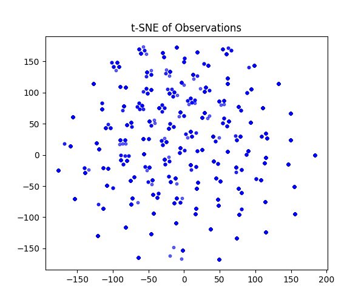
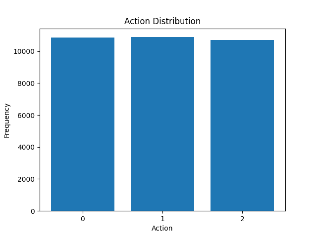
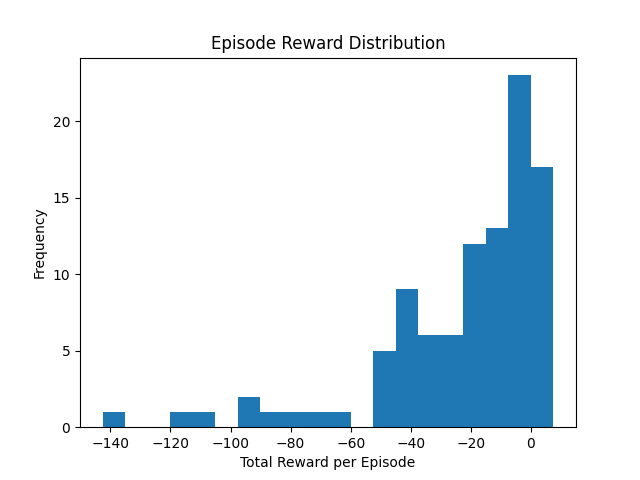

## 🚀 Project Overview

**NeuroQuant Agent** is a fully custom offline reinforcement learning benchmark, built from the ground up with real-time constraints, compression-aware inference, and deployment to latency-constrained environments.

The project begins with a custom-built 10×10 gridworld environment that supports:

- 🔁 **Directional movement**: The agent can turn left, go forward, or turn right relative to its current orientation.
- 👁️ **Partial observability**: Instead of seeing the entire map, the agent receives a 3×3 view centered around its position.
- ⛔ **Obstacles**: Impassable wall tiles block the agent's path and require navigation.
- 🎯 **Goal tile**: A single terminal state gives a large positive reward when reached.
- 🖥️ **Real-time PyGame rendering**: Each simulation step is rendered at 10 FPS for visual inspection and timing fidelity.

This environment supports:
- Offline dataset generation
- Training offline RL agents using CQL, BCQ, or TD3+BC
- Evaluating model compression tradeoffs (quantization, pruning, distillation)
- Deploying agents under strict latency and memory constraints

---

## 🧠 Environment Design

The environment is a 10×10 gridworld with partial observability and discrete relative movement.

**Key Features:**
- 🔁 Action space: `Turn Left`, `Move Forward`, `Turn Right`
- 👁️ Observation: 3×3 local view centered on the agent
- 🔢 Dual modes:
  - **Image** mode (local grid)
  - **Vector** mode (`[agent_x, agent_y, goal_x, goal_y]`)
- 🎯 Reward structure:
  - `+10` for reaching the goal
  - `-0.1` per step
- ⛔ Obstacles block movement
- 🖥️ Real-time PyGame rendering at 10 FPS

---

## 🧠 Replay Buffer Generation

We simulate random agents in the custom environment to collect experience for offline RL.

Each transition includes:
- `observation`
- `action`
- `reward`
- `next_observation`
- `done`

Generated data is saved in:
- ✅ `dataset/replay_buffer.npz` – transition buffer
- 📝 `dataset/metadata.txt` – episode stats
- 📊 `dataset/reward_histogram.png` – episode reward distribution

To generate the dataset, run:

```bash
python dataset/collect.py --episodes 100

```

## 📁 Project Structure

```bash
offline-rl-agent/
│
├── env/                    # Custom Gym-like environment
│   └── neuroquant_env.py
│
├── dataset/                # Replay buffer + visualizations
│   ├── collect.py
│   ├── viz.py
│   ├── replay_buffer.npz
│   ├── reward_histogram.png
│   ├── metadata.txt
│
├── agent/                  # CQL training code
│   ├── train.py
│   └── cql.py
│
├── docs/                   # Visual assets
│   ├── tsne_obs.png
│   ├── action_distribution.png
│   ├── episode_rewards.png
│   ├── cql_training_losses.png
│   └── replays/
│       └── test_run.gif
│
├── .gitignore
├── README.md
└── run_env_test.py
```

---

## 📊 Dataset Visualizations

We visualize the replay buffer to verify coverage and diversity.

- 🌀 **t-SNE of State Vectors**  
  

- 🎮 **Action Distribution**  
  

- 🎯 **Episode Reward Distribution**  
  

To generate these plots, run:

```bash
python dataset/viz.py

```

---

## 🏋️ Training the CQL Agent

We train a Conservative Q-Learning (CQL) agent on the replay buffer using PyTorch.

**Agent Highlights:**
- Inputs: vector observations
- Discrete 3-action space
- 2-layer Q-network and policy
- Losses:
  - Bellman loss
  - Conservative penalty
  - (Optional) behavior cloning loss

Run training:

```bash
python agent/train.py
```

Logs print every 100 epochs with:
- Bellman loss
- Conservative loss
- BC loss (if enabled)

---

## 📉 Training Loss Visualization

Below is the training loss of the CQL agent over 1000 epochs:


- **Bellman Loss**: TD error between predicted and target Q-values
- **Conservative Loss**: Penalizes high Q-values for unseen actions
- **Behavior Cloning Loss**: Aligns learned policy with dataset behavior

---

## 🎥 Demos + GIFs

The environment supports rendering full episodes as GIFs via `render_episode_gif()`.

Example replay:


---

## 🛠️ Getting Started

```bash
# Clone and enter repo
git clone https://github.com/mansoor-mamnoon/offline-rl-agent.git
cd offline-rl-agent

# Set up venv
python3 -m venv .venv
source .venv/bin/activate

# Install dependencies
pip install -r requirements.txt

# Run environment manually
python run_env_test.py

# Collect data
python dataset/collect.py --episodes 100

# Visualize replay buffer
python dataset/viz.py

# Train the agent
python agent/train.py
```

---

Let me know if you'd like to add evaluation metrics, save checkpoints, or display learning curves in real-time!


