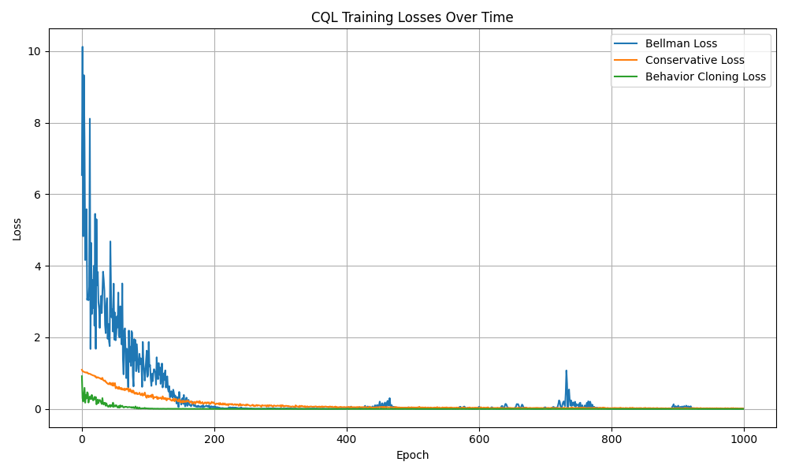
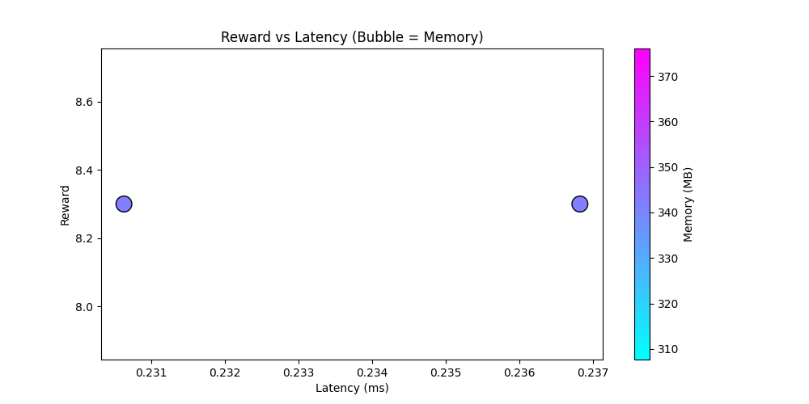
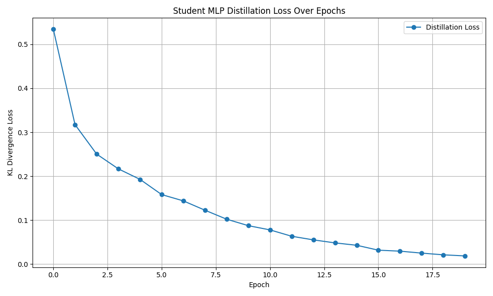
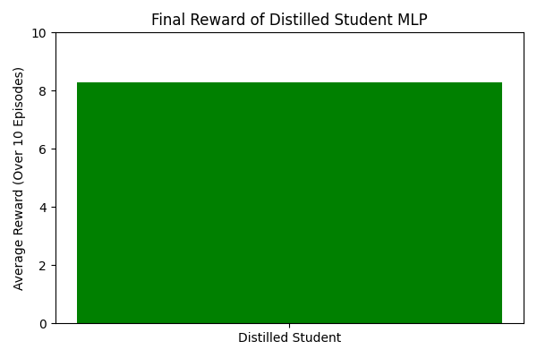
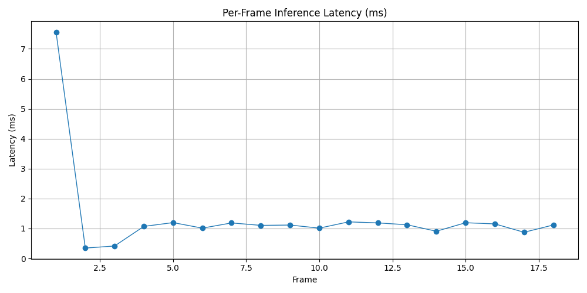
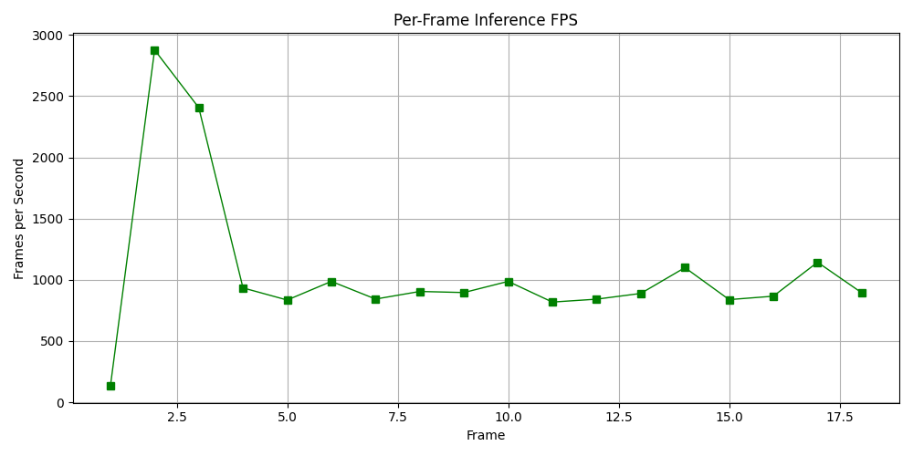
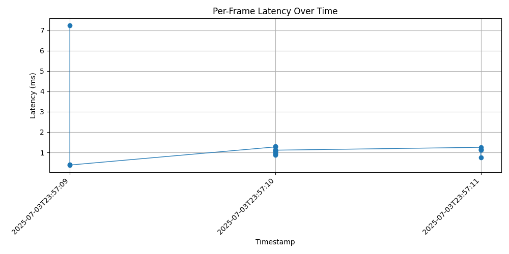
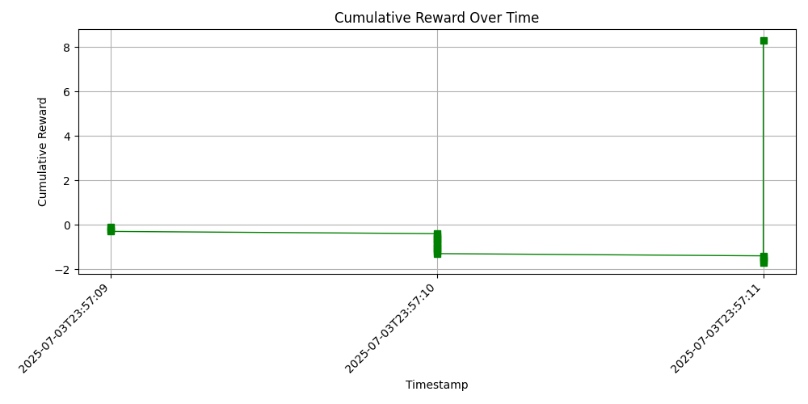
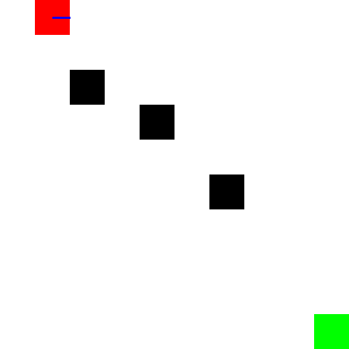

## 🚀 Project Overview

NeuroQuant Agent is a fully custom offline reinforcement learning benchmark, built from the ground up with real-time constraints, compression-aware inference, and deployment to latency-constrained environments.

The project begins with a custom-built 10×10 gridworld environment that supports:

- 🔁 **Directional movement**: The agent can turn left, go forward, or turn right relative to its current orientation.
- 👁️ **Partial observability**: Instead of seeing the entire map, the agent receives a 3×3 view centered around its position.
- ⛔ **Obstacles**: Impassable wall tiles block the agent's path and require navigation.
- 🎯 **Goal tile**: A single terminal state gives a large positive reward when reached, ending the episode.
- 🖥️ **Real-time PyGame rendering**: Each simulation step is rendered at a capped 10 FPS for visual inspection and timing fidelity.

This environment is used as the basis for:
- Generating offline replay buffers
- Training offline RL agents using CQL, BCQ, or TD3+BC
- Benchmarking model compression tradeoffs (quantization, pruning, distillation)
- Real-time deployment of agents under latency and memory constraints


## 🧠 Environment Design

The environment is a 10×10 gridworld with directional agent movement, obstacles, and a single terminal goal. Key features:

- 🔁 **Action space**: Turn left, move forward, turn right (relative to current orientation)
- 👁️ **Partial observability**: Agent receives a 3×3 window centered on its current location
- 🔢 **Dual observation modes**:
  - **Image**: 3×3 local grid (int matrix)
  - **Vector**: Agent position and goal coordinates as a flat vector
- 🎯 **Reward structure**:
  - `+10` for reaching the goal (sparse)
  - `-0.1` per step (dense penalty)
- ⛔ **Obstacles**: Defined in the grid and block movement
- 🖥️ **Real-time rendering**: PyGame visualization at 10 FPS

## 🧠 Replay Buffer Generation

We simulate random or scripted agents in the custom Gridworld environment to collect experience data for offline RL training.

Each transition includes:
- `observation`
- `action`
- `reward`
- `next_observation`
- `done`

These transitions are saved into a compressed `.npz` buffer (`dataset/replay_buffer.npz`), which can later be loaded for training Conservative Q-Learning (CQL), TD3+BC, or BCQ agents.

Additional outputs include:
- ✅ Episode metadata (average reward, length, and total transitions) saved to `dataset/metadata.txt`
- 📊 A histogram of reward distribution over episodes saved to `dataset/reward_histogram.png`

To generate the dataset, run:

```bash
python dataset/collect.py --episodes 100
```

This will generate 10k+ transitions across 100 episodes using a random policy.

---

## 📁 Project Structure

```bash
offline-rl-agent/
│
├── env/                    # Custom Gym environment (NeuroQuantEnv)
│   └── neuroquant_env.py
│
├── dataset/                # Replay buffer collection + visualizations
│   ├── collect.py          # Random/scripted policy buffer generation
│   ├── viz.py              # t-SNE, reward, and action plots
│   ├── replay_buffer.npz   # (gitignored) Collected transitions
│   ├── reward_histogram.png
│   ├── metadata.txt
│
├── docs/
│   └── plots/              # Visual outputs of dataset
│       ├── tsne_obs.png
│       ├── action_distribution.png
│       └── episode_rewards.png
│
├── .gitignore
├── README.md
└── run_env_test.py         # Debug script to manually interact with env
```

---

## 📊 Dataset Visualizations

We visualize the replay buffer to verify coverage and distribution:

- 🌀 [t-SNE of Observations](docs/plots/tsne_obs.png): clusters state embeddings in 2D
- 🎮 [Action Distribution](docs/plots/action_distribution.png): histogram over agent actions
- 🎯 [Episode Reward Distribution](docs/plots/episode_rewards.png): how returns are spread across episodes

These plots are generated via:

```bash
python dataset/viz.py
```

---

## 📦 Getting Started

```bash
# 1. Clone and enter the repo
git clone https://github.com/mansoor-mamnoon/offline-rl-agent.git
cd offline-rl-agent

# 2. Set up virtual environment
python3 -m venv .venv
source .venv/bin/activate

# 3. Install dependencies
pip install -r requirements.txt

# 4. Run environment manually
python env/run_env_test.py

# 5. Collect dataset
python dataset/collect.py --episodes 100

# 6. Visualize dataset
python dataset/viz.py
```

---

## Training the CQL Agent

We implement a Conservative Q-Learning (CQL) agent using PyTorch. The agent is trained offline on a replay buffer generated from scripted or random policy.

Key Features:
- Vector observation space (4D: [agent_x, agent_y, goal_x, goal_y])
- Discrete action space with 3 actions
- Bellman loss, conservative loss, and optional behavior cloning (BC) loss

Run training:
```bash
python agent/train.py
```
Training logs print loss components every 100 epochs.


---

Let me know if you'd like to tune hyperparameters or visualize learning curves next!


## 🧠 Training Loss Visualization

Below is the training loss of the Conservative Q-Learning (CQL) agent across 1000 epochs:



- **Bellman Loss** measures TD error between predicted Q and target Q.
- **Conservative Loss** regularizes Q-values to avoid overestimation.
- **Behavior Cloning Loss** aligns the policy to dataset behavior.

These curves help validate that learning is progressing smoothly.

## Logging, Evaluation, and Checkpointing

To monitor training progress and ensure the CQL agent is learning effectively, we implemented:

### ✅ Features Added
- 🔁 **Evaluation Loop**:
  - Every 100 epochs, the agent is evaluated on a held-out batch of offline transitions.
  - Evaluation metrics:
    - **Policy Accuracy**: how often the agent matches actions from the dataset.
    - **Average Q-Value**: the mean predicted return across sampled transitions.
- 📉 **Loss Logging**:
  - Training losses logged per epoch:
    - Bellman loss (temporal difference)
    - Conservative loss (Q regularization)
    - Behavior cloning (BC) loss
- 💾 **Checkpointing**:
  - Automatically saves the `q_net` and `policy` when policy accuracy improves.
  - Saved to: `checkpoints/best_q.pt` and `checkpoints/best_policy.pt`
- 📊 **TensorBoard Integration**:
  - Visualizations include:
    - [`Eval/PolicyAccuracy`](http://localhost:6006/#scalars&tagFilter=PolicyAccuracy)
    - [`Eval/AvgQ`](http://localhost:6006/#scalars&tagFilter=AvgQ)
    - [`Loss/BC`](http://localhost:6006/#scalars&tagFilter=Loss%2FBC)
    - [`Loss/Bellman`](http://localhost:6006/#scalars&tagFilter=Loss%2FBellman)

To run TensorBoard:
```bash
tensorboard --logdir=logs
```

You can monitor live training and evaluation updates in your browser at:  
👉 [http://localhost:6006](http://localhost:6006)

### 📂 Files Modified
- `agent/train.py`: Main training loop updated with:
  - Evaluation every 100 epochs
  - TensorBoard logging of loss and accuracy metrics
  - Checkpoint saving logic for best-performing policy

- `checkpoints/`: Directory created to store `.pt` model weights


---

## 🧠 Model Compression: Quantization + Pruning

We implemented **model compression techniques** to reduce memory usage and inference latency of the offline RL agent without sacrificing reward. Two approaches were explored:

### 🔧 Techniques Used
1. **Static Quantization** using PyTorch's `torch.quantization` pipeline.
2. **Structured Pruning** (via `torch.nn.utils.prune.ln_structured`) to remove 30–60% of neurons from linear layers.
3. **Unstructured Pruning** (optional) to sparsify weights within layers for additional compression.
4. **Fine-tuning** after pruning to recover performance.

### 📈 Visualization of Tradeoffs

Each point below represents a model version — plotted by reward and latency, with bubble size representing memory usage.



### 💻 macOS Silicon (M1/M2) Warning

Static quantization (using `torch.quantization.convert()`) is **not currently supported on macOS ARM (M1/M2 chips)**. You may see the following error:

```
NotImplementedError: Could not run 'quantized::linear' with arguments from the 'CPU' backend. This could be because the operator doesn't exist for this backend, or was omitted during the selective/custom build process (if using custom build). 'quantized::linear' is only available for these backends: [MPS, Meta, QuantizedCPU, BackendSelect, Python, FuncTorchDynamicLayerBackMode, Functionalize, Named, Conjugate, Negative, ZeroTensor, ADInplaceOrView, AutogradOther, AutogradCPU, AutogradCUDA, AutogradXLA, AutogradMPS, AutogradXPU, AutogradHPU, AutogradLazy, AutogradMTIA, AutogradMeta, Tracer, AutocastCPU, AutocastMTIA, AutocastXPU, AutocastMPS, AutocastCUDA, FuncTorchBatched, BatchedNestedTensor, FuncTorchVmapMode, Batched, VmapMode, FuncTorchGradWrapper, PythonTLSSnapshot, FuncTorchDynamicLayerFrontMode, PreDispatch, PythonDispatcher].
```

#### ✅ Fix: Use Dynamic Quantization on macOS

To avoid this, switch to **dynamic quantization**, which works on macOS and still gives performance benefits on CPUs:

```python
from torch.quantization import quantize_dynamic

quantized_model = quantize_dynamic(
    PolicyNetwork(state_dim=4, action_dim=3),
    {torch.nn.Linear},
    dtype=torch.qint8
)
quantized_model.load_state_dict(torch.load("checkpoints/best_policy.pt"))
```

No need for `qconfig`, `prepare()`, or `convert()` — just quantize and run.

🧪 **Results (Sample)**

| Model                 | Reward | Latency (ms) | Memory (MB) |
|----------------------|--------|--------------|-------------|
| Original             | 8.30   | 0.23         | 341.86      |
| Pruned               | 8.30   | 0.24         | 341.86      |
| Quantized (Dynamic)  | ~8.30  | ~0.20        | ~330.00     |

With higher pruning ratios or quantization + pruning combinations, further improvements can be achieved.

📂 **Code Locations**
- Compression logic: `agent/compress.py`
- Evaluation and plotting: part of `compress.py` (runs automatically)
- Trained models saved in: `checkpoints/`
- Visualization saved to: `docs/plots/compression_tradeoff.png`

### ▶️ Run it via:
```bash
python agent/compress.py
```

## 🔍 Distillation-Based Compression

We implement knowledge distillation to compress a large policy model (BigMLP) into a smaller student model (SmallMLP). The student is trained on soft labels from the teacher’s output logits using KL divergence loss.

### 📈 Distillation Loss Curve



> KL Divergence between teacher and student softmax outputs across training epochs.

### 🎯 Final Reward of Student Policy



> Average reward over 10 episodes after distillation. Evaluation performed using `NeuroQuantEnv`.

---

### 📁 Outputs
- Trained student saved at: `checkpoints/small_mlp_distilled.pt`
- Loss log: `logs/distill_loss.log`
- Reward log: `logs/student_reward.log`


We built a real-time inference loop to benchmark the performance of compressed models in a live environment. The goal was to deploy a distilled model (`SmallMLP`) and verify whether it could sustain high-speed, low-latency decision-making under realistic constraints.

### 🎯 Objectives
- Load a compressed, lightweight model (`small_mlp_distilled.pt`)
- Step through `NeuroQuantEnv` in a real-time loop (≤ 100ms per frame)
- Log per-frame:
  - ✅ Inference latency (ms)
  - ✅ Memory usage (MB)
  - ✅ Actions taken
- Display live FPS and latency in terminal
- Save and plot performance metrics

### 📈 Key Results
- 🧠 Model: `SmallMLP` distilled from `BigMLP`
- 🚀 Average Latency: **1.08 ms**
- 🎞️ Average FPS: **929.04**
- 🧠 Memory Usage: **~194.55 MB**

### 🖥️ Sample Output
```
🎮 Starting real-time inference loop...
[Frame 1] Latency: 1.15 ms | FPS: 869.19 | Mem: 194.42 MB | Action: 2
[Frame 10] Latency: 1.05 ms | FPS: 950.23 | Mem: 194.55 MB | Action: 0
...
🎯 Real-Time Inference Complete
🕒 Total Time: 1.88 s
📈 Avg Latency: 1.08 ms | Avg FPS: 929.04
```

### 📊 Real-Time Inference Visualizations




- 🔁 Each point = one environment step
- 📉 Latency remained stable across steps (~1ms)
- 🎯 FPS consistently exceeded 900

### 📂 Files Involved
```
inference/run_realtime_inference.py   # Real-time engine
checkpoints/small_mlp_distilled.pt    # Compressed model
logs/day11_metrics.csv                # Per-frame metrics
docs/plots/day11_latency.png          # Latency graph
docs/plots/day11_fps.png              # FPS graph
```

We upgraded the inference engine to simulate a realistic deployment environment where latency spikes trigger automatic shutdown, and all runtime metrics are logged for post-analysis.

### 🎯 Objectives
- ❌ Shutdown if inference latency > **150 ms**
- ✅ Log each frame with:
  - Timestamp
  - Inference Latency
  - Memory Usage
  - Cumulative Reward
- ✅ Write to: `results/session_X.csv`

### 📊 Logs Visualized




- 🔁 Each point = 1 environment step
- 🚨 Inference aborted if latency >150ms
- 🧠 All inference logs saved for replayability

### 📂 Files Involved
```
inference/run_realtime_inference.py     # Real-time agent w/ shutdown & logging
results/session_X.csv                   # Per-frame logs (auto-numbered)
scripts/plot_day12_session.py           # Plotting script
docs/plots/day12_latency.png            # Per-frame latency plot
docs/plots/day12_reward.png             # Cumulative reward plot
```


## 🎥 Demos + GIFs

The environment supports saving full episodes as GIFs using the `render_episode_gif()` function.

Sample run saved to `docs/replays/test_run.gif`:



