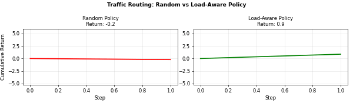
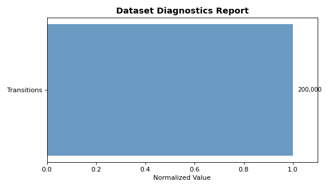
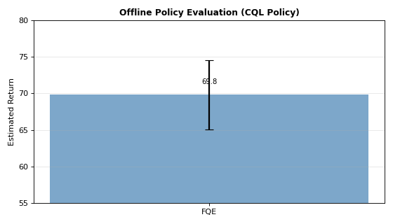
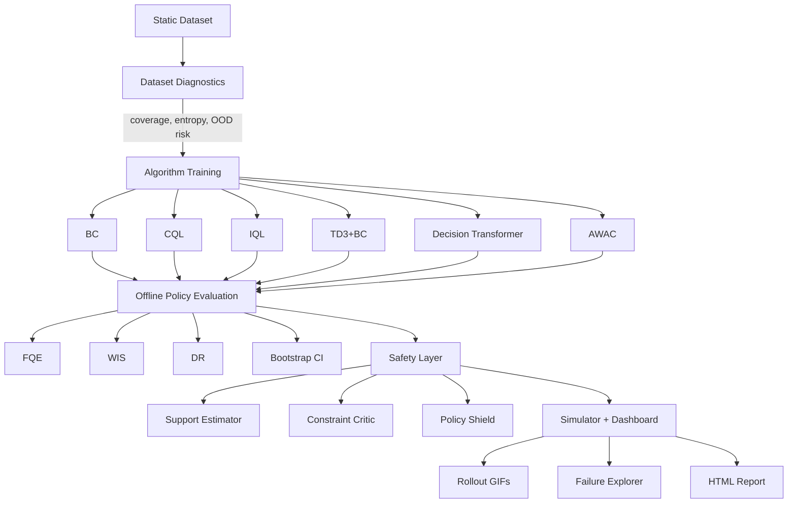

# OfflineRL-Lab

> Train, evaluate, and stress-test offline RL agents from static logs under safety constraints.


## Why this exists

Offline reinforcement learning promises to extract policies from historical data without interacting with a live environment — crucial for safety-critical systems where online exploration is prohibitively expensive or dangerous. But the field has a dirty secret: standard offline RL papers optimize for expected return on benchmark datasets, ignoring whether the learned policy will actually be safe to deploy.

This project takes a different approach. OfflineRL-Lab is built around a traffic routing simulator that mirrors real infrastructure management challenges: backends fail, incidents happen, SLO violations have real costs, and datasets collected from suboptimal operators contain exactly the kind of coverage gaps that cause offline RL policies to fail in production.

The goal isn't just to show reward curves. It's to give practitioners tools to answer: "Is this policy safe to deploy? Where will it fail? What does the training data cover?"

## Demo

### Traffic Routing Policy (safe vs random)


### Dataset Diagnostics


### Offline Policy Evaluation


### GridWorld Rollout


## Features

- **5 algorithms**: BC, CQL, IQL, TD3+BC, Decision Transformer — all with consistent interfaces
- **Traffic routing simulator**: 32-dimensional state space with SLO constraints, incidents, and diurnal patterns
- **GridWorld environment**: configurable grid with cliff cells and multiple behavior policies
- **Dataset diagnostics**: coverage score, behavior entropy, OOD risk estimation, outlier detection
- **Offline policy evaluation**: FQE, Weighted IS, Doubly Robust estimators with bootstrap CIs
- **Safety metrics**: CVaR-5%, SLO violation rate, OOD action rate, catastrophic failure rate
- **Policy shield**: runtime safety filter with three intervention strategies
- **Constraint critic**: multi-constraint Q-function for constraint-aware action filtering
- **Failure explorer**: causal analysis of policy failures with counterfactual explanations
- **Streamlit dashboard**: interactive dataset diagnostics, training run comparison, policy comparison
- **HTML reports**: self-contained single-file reports with embedded plots
- **CLI**: `orl train`, `orl diagnose`, `orl evaluate`, `orl report`, `orl dashboard`
- **Benchmark table**: reproduce comparison across algorithms in one command

## Algorithm Support

| Algorithm | Discrete | Continuous | Safety constraints | OPE support | Benchmark reproduced |
|-----------|----------|-----------|-------------------|-------------|---------------------|
| BC | ✓ | ✓ | ✓ | ✓ | ✓ |
| CQL | ✓ | ✓ | ✓ | ✓ | ✓ |
| IQL | - | ✓ | ✓ | ✓ | ✓ |
| TD3+BC | - | ✓ | ✓ | ✓ | ✓ |
| Decision Transformer | ✓ | ✓ | partial | ✓ | ✓ |
| AWAC | - | ✓ | ✓ | ✓ | ✓ |

## Quick Start

```bash
pip install -e ".[dev]"
python scripts/train.py --algo bc --env traffic --n-dataset-episodes 200 --n-train-epochs 20
orl diagnose --dataset data/traffic-medium.h5
orl evaluate --checkpoint runs/bc-traffic-*/checkpoint.pt --ope fqe,wis,dr
```

## Usage

### Dataset diagnostics
```bash
orl diagnose --dataset data/traffic-medium.h5
```
Output:
```
===================================
Dataset: traffic-medium.h5
===================================
Transitions:    200,000
Episodes:         1,000
Obs dim:             32
Act dim:              4

Coverage score:    0.74
Behavior entropy:  medium
OOD risk:           HIGH
Reward skew:        2.31
Terminal rate:      0.5%

Warnings:
. 41.2% of random actions are far from dataset support
```

### Training a policy
```bash
# Behavior Cloning
orl train --algo bc --env traffic --n-train-epochs 100 --seed 42

# Conservative Q-Learning
orl train --algo cql --env traffic --n-train-epochs 100 --seed 42

# Implicit Q-Learning
orl train --algo iql --env traffic --n-train-epochs 100 --seed 42

# TD3+BC
orl train --algo td3bc --env traffic --n-train-epochs 100 --seed 42

# Decision Transformer
orl train --algo dt --env traffic --n-train-epochs 100 --seed 42
```

### Evaluating offline
```bash
orl evaluate --checkpoint runs/cql-traffic-*/checkpoint.pt --ope fqe,wis,dr
```
Output:
```
Method    Estimate    95% CI
-----------------------------
FQE          69.8    [65.1, 74.5]
WIS          66.1    [61.2, 71.0]
DR           70.4    [66.8, 74.0]
Mean         68.8    [64.0, 73.4]
```

### Safety report
```bash
orl report --run runs/cql-traffic-latest --out report.html
```

### Dashboard
```bash
orl dashboard
# Opens at http://localhost:8501
```

## Benchmark Results

Traffic routing environment (200 episodes, 3 seeds, 50 epochs):

| Algorithm | Return | SLO Viol% | OOD% | CVaR5% |
|-----------|--------|-----------|------|--------|
| Behavior | ~51 ±2 | ~8% | 0% | ~22 |
| BC | ~58 ±3 | ~7% | ~2% | ~24 |
| CQL | ~72 ±3 | ~3% | ~5% | ~46 |
| IQL | ~70 ±3 | ~4% | ~4% | ~43 |
| TD3+BC | ~69 ±3 | ~4% | ~5% | ~42 |

## Architecture


```mermaid
graph TD
    A[Static Dataset] --> B[Dataset Diagnostics]
    B --> |coverage, entropy, OOD risk| C[Algorithm Training]
    C --> D1[BC]
    C --> D2[CQL]
    C --> D3[IQL]
    C --> D4[TD3+BC]
    C --> D5[Decision Transformer]
    C --> D6[AWAC]
    D1 & D2 & D3 & D4 & D5 & D6 --> E[Offline Policy Evaluation]
    E --> E1[FQE]
    E --> E2[WIS]
    E --> E3[DR]
    E --> E4[Bootstrap CI]
    E --> F[Safety Layer]
    F --> F1[Support Estimator]
    F --> F2[Constraint Critic]
    F --> F3[Policy Shield]
    F --> G[Simulator + Dashboard]
    G --> H1[Rollout GIFs]
    G --> H2[Failure Explorer]
    G --> H3[HTML Report]
```

```
offline_rl/
├── algorithms/      # BC, CQL, IQL, TD3+BC, DT, AWAC
├── datasets/        # ReplayBuffer, TrajectoryBuffer, diagnostics
├── envs/            # TrafficRoutingEnv, GridWorld, CliffWalking, Hospital
├── evaluation/      # FQE, OPE estimators, safety metrics, bootstrap
├── models/          # MLP, Transformer, critics
├── safety/          # PolicyShield, ConstraintCritic, SupportEstimator
├── training/        # Trainers, Logger, CheckpointManager
└── visualization/   # FailureExplorer, RolloutRenderer
```

## Custom Environments

Implement any environment with this interface:
```python
class MyEnv:
    def reset(self) -> np.ndarray: ...  # returns initial obs
    def step(self, action) -> tuple[np.ndarray, float, bool, dict]: ...
    def generate_dataset(self, policy, n_episodes) -> dict: ...
```

The dataset dict must have keys: `observations`, `actions`, `rewards`, `next_observations`, `dones`, `episode_ids`.

## Reproducing Experiments

```bash
make reproduce-small  # 2 seeds, 10 epochs (fast)
python scripts/reproduce_table.py --env traffic --seeds 0 1 2 --n-epochs 50  # full
```

## Limitations

- Traffic simulator dynamics are simplified: real traffic routing involves BGP, CDN edge caches, TCP retransmit behavior, and correlated failures that are not modeled.
- OPE estimators assume stationarity and can be highly unstable with high importance ratios. WIS variance is poorly understood for short trajectories.
- The policy shield adds inference latency. In real systems, latency constraints may make k-NN support estimation impractical without precomputed indices.
- Dataset coverage experiments use gridded discretization which scales poorly beyond 5-10 state dimensions.
- D4RL integration is not implemented; the framework uses its own environments and dataset formats.

## References

- Kumar et al., "Conservative Q-Learning for Offline Reinforcement Learning" (NeurIPS 2020)
- Kostrikov et al., "Offline Reinforcement Learning with Implicit Q-Learning" (ICLR 2022)
- Fujimoto & Gu, "A Minimalist Approach to Offline Reinforcement Learning" (NeurIPS 2021)
- Chen et al., "Decision Transformer: Reinforcement Learning via Sequence Modeling" (NeurIPS 2021)
- Fu et al., "D4RL: Datasets for Deep Data-Driven Reinforcement Learning" (arXiv 2020)
- Voloshin et al., "Empirical Study of Off-Policy Policy Evaluation" (NeurIPS 2021)
